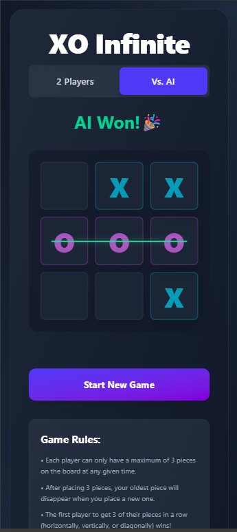

# ♾️ Xoinfy - Infinite Tic-Tac-Toe

[](https://github.com/LakhindarPal/xoinfy/stargazers)
[](https://github.com/LakhindarPal/xoinfy/network)
[](https://github.com/LakhindarPal/xoinfy/issues)
[](https://github.com/LakhindarPal/xoinfy/blob/main/LICENSE)
[](https://xoinfy.netlify.app)

> ⚡ A next-gen, unpredictable twist on classic Tic-Tac-Toe — infinite gameplay, guaranteed wins, and strategic madness!

---

## 🎮 Game Modes

- **🧠 Single Player (vs AI)** — Smart, challenging bot opponent.
- **🧑‍🤝‍🧑 Mingle Mode (2 Player Local Multiplayer)** — Share the same device and battle it out with friends.

## ✨ Features

- ♾️ **Infinite Moves**: After the third move, the earliest move disappears, keeping the game dynamic.
- ✅ **Guaranteed Wins**: No more draws — every match ends with a winner.
- 🔢 **Move Counter**: Displays total moves at the end of the match.
- 🤖 **AI Opponent**: Built to challenge you with intelligent play.
- 🧑‍💻 **Local Multiplayer**: Play with another human on one screen.

---

## 🚀 Tech Stack

- **Frontend:** React + Vite
- **Styling:** Tailwind CSS
- **State Management:** React Hooks (useState, useEffect)

---

## 🛠️ Installation & Running Locally

```bash
# Clone this repo
git clone https://github.com/LakhindarPal/xoinfy.git
cd xoinfy

# Install dependencies
npm install

# Run the app
npm run dev
```

Open [http://localhost:5173](http://localhost:5173) to view it in your browser.

---

## 📦 Build for Production

```bash
npm run build
```

---

📸 Screenshots



---

🤝 Contributing

Have ideas or found a bug?
PRs, Issues, and Stars are always welcome!

1. Fork the project
2. Create your feature branch (`git checkout -b feature/AmazingFeature`)
3. Commit your changes (`git commit -m 'Add some AmazingFeature'`)
4. Push to the branch (`git push origin feature/AmazingFeature`)
5. Open a Pull Request

---

📄 License

This project is licensed under the [MIT License](LICENSE).
