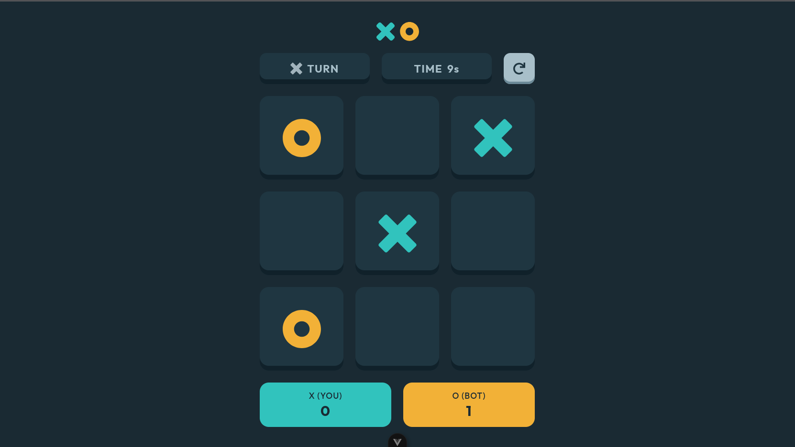
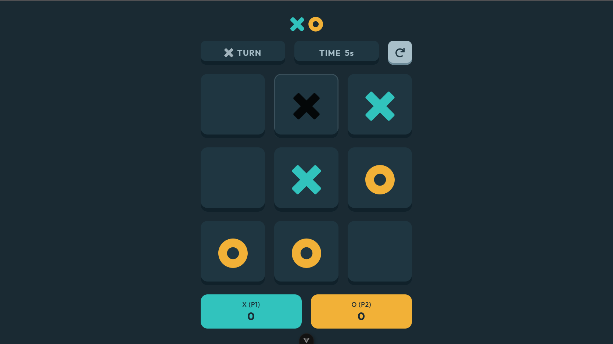

# ♾️ XOinfy: Infinite Tic-Tac-Toe Strategy Game


A modern, infinite twist on the classic 3x3 game where your oldest moves disappear!

**[🕹️ Play Live Demo](https://xoinfy.netlify.app/)** · **[Read Rules](#rules-of-the-game)**


## 📸 Game Previews

<p align="center">
  
  
</p>
<p align="center">
  
  
</p>

### Rules of the game

1. X goes first.
2. You can only have 3 active marks on the board at a time.
3. Placing a 4th mark will remove your oldest mark.
4. Get your 3 active marks in a row to win the round!
5. Move before the 10-second timer runs out, or you forfeit the round.

## 🚀 Tech Stack

- **Framework:** Vue 3 (Composition API, `<script setup>`)
- **Language:** TypeScript
- **Tooling:** Vite
- **Styling:** Tailwind CSS v4 (using `@theme` variables)
- **Formatting / Linting:** Oxlint, Oxfmt, ESLint

## 🛠️ Local Development

Ensure you have [Bun](https://bun.sh/) or Node.js installed on your machine.

### Setup Instructions

1. **Clone the repository:**

```sh
git clone https://github.com/LakhindarPal/xoinfy.git
cd xoinfy
```

1. **Install dependencies:**

```sh
bun install
```

1. **Start the development server:**

```sh
bun run dev
```

1. **Build for production:**

```sh
bun run build
```

1. **Lint and format code:**

```sh
bun run lint
bun run format
```

## 🤝 Contributing

Have ideas or found a bug? PRs, Issues, and Stars are always welcome!

1. Fork the project
2. Create your feature branch (`git checkout -b feature/AmazingFeature`)
3. Commit your changes (`git commit -m 'Add some AmazingFeature'`)
4. Push to the branch (`git push origin feature/AmazingFeature`)
5. Open a Pull Request

## 📜 License

This project is licensed under the [MIT License](LICENSE).

---
